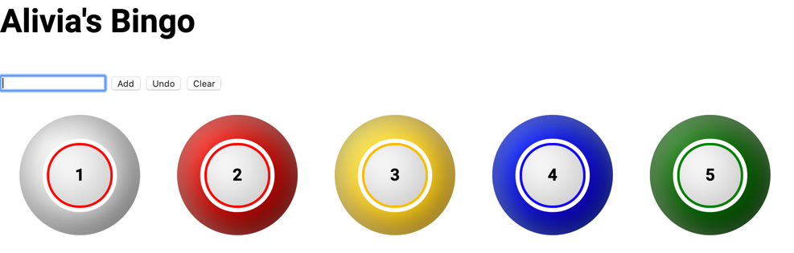

# bingo

This is a VERY simple single HTML page that can be used to play a game of
Bingo.  The idea is simple...  Every time a ball is called, it can be entered
into the text box, and a new ball will appear with the number in it.  You
can continue adding new numbers, and once you have added 5 balls, it will
start removing the first ball that was added.  It will always show the last
5 balls that were called.

## Buttons

### Add

Add a new Bingo ball, using the current text in the input textbox.

### Undo

This will remove the last Bingo ball that was called.

### Clear

This will clear all of the Bingo balls that have currently been called.

## Example Screenshot

